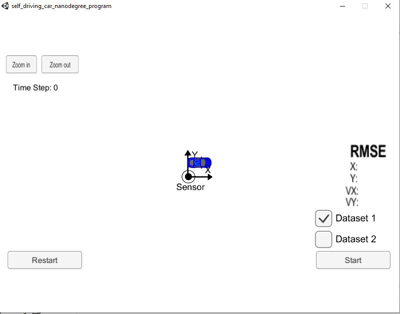
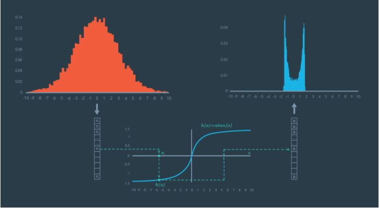
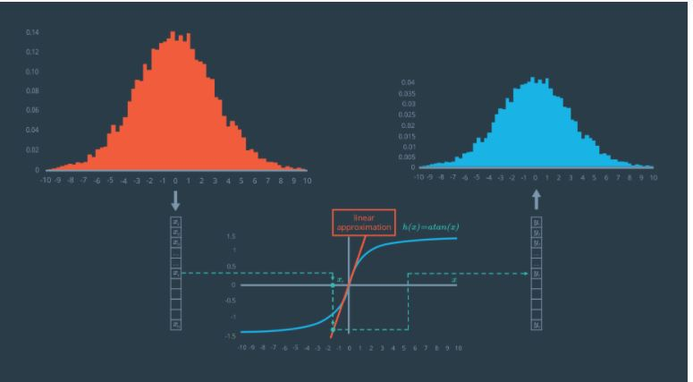
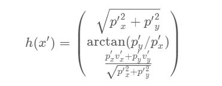
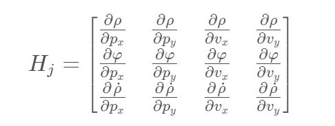
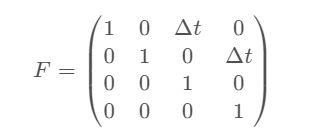
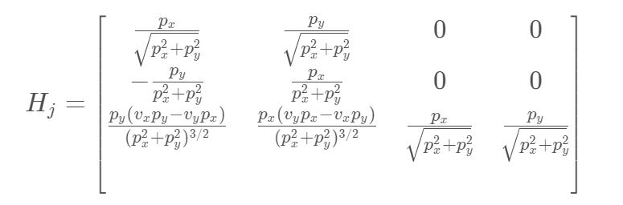
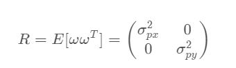

# Extended Kalman Filter Project Starter Code

<h1> Overview </h1>

  The project focusses using the sensor fusion technique to estimate the position of vehicle (in this case a bicycle) and also the velocity of the vechile in both x and y directions. The sensors used here are RADAR and LiDAR. RADAR sensors are useful for measuring the velocity and direction of the movement of the object. Similarily LiDAR is used to measure the x and y position of the object. So we fuse both these sensors to get the estimate of x & y position and x & y direction velocity. The sensors have noise in their readings and so we need to process it to get accurate position and velocity which is the key for the self driving car. Here we use the Kalman filter approch to provide estimation of the moving object. 

 
<h1> Sensor data processing technique </h1>

 The LiDAR sensor provides a measurement of the position of the object in x and y dimensions. These values are all linear in nature. So the Kalman filter is directly used to process the sensor data. The Kalman filter uses Gaussian distribution and provides and output in a Gaussian Curve with mean and SD.On the other hand the RADAR provides a non linear measurements (involving sqaure roots which are non linear). Since the kalman filter uses Gaussian distribution it cannot handle non linear data. Since a non linearity changes the shape of the Gaussian distribution as shown below.

 So to solve this we use a linearized version of the curve by taking the origin as the equilibrium point and linearize around a small neighbourhood. We use taylor series expansion and take the first two terms as they show the linear region around the origin.

 Since this problem involves 3D (3 measurments). We need to use multivariate taylor series to perform the linearzition around the equilibrium point.

 where Df(a) is called the Jacobian matrix and D^2 f(a) is called the Hessian matrix. They represent first order and second order derivatives of multi-dimensional equations. Here we consider only the Jacobian matrix for linearization. Thus now if we use Kalman filter over the linearized version of the measurment curve, the Gaussian distribution is preserved at the output as in the image. This use of Jacobian in the kalman filter leads to the use of Extended Kalman filtering.

 

 The RADAR provides three measurments values. The Rho provides the radial distance from the origin. The phi provided the angle between the Rho line and x axis. Finally the Rho dot provides the radial velocity of the object which is tracked.

 These measurments being highly non linear may need to be converted to linear values around the equilibrium point by the use of Jacobians. Since we have 4 states we need to compute the Jacobian (partial differential) for each of the states and for each of the measurement value.

 
<h3> Kalman Filter and Extended Kalman filter </h3>

 The kalman filter first initializes all its matrices and then performs predict and update continuously. The various matrices are as below 

<ul>
 <li> x -> State vector. This denotes the possible states to be predicted. (size : Number of states x 1) </li>
 <li> P -> Uncertainity Matrix. This denotes the uncertainity in the prediction. The matrix is of diagonal matrix with the uncertinities of each state in the corresponding element. Each time after updation the Kalman filter reduces the error and therby reducing the value in the matrix. A value closer to zero is that Filter output is perfect. (Size : Number of states x Number of states).</li>
 <li> F -> State Transition Matrix. This denotes the state transition equation for each states. (Size : Number of States x Number of States). </li>
 <li> H -> Measurement Matrix. This is useful for selecting the new states values from the measurements vector which may contain all the measurements (Size : Number of measurements x Number of states). </li>
 <li> R -> Measurement Uncertainity. This denotes the uncertainity in the sensor values. This is also a diagonal matrix with uncertainity for each measurement in the corresponding diagonal. (Size: Number of measurements x Number of Measurements). </li>
</ul>

<h5> Kalman filter Initialization </h5>

<H6> State transition Matrix </h6>

The state equations are given below. 

<UL>
 <li> X(t+1) = X(t) + (X`(t) * dt) </li>
 <li> Y(t+1) = Y(t) + (Y`(t) * dt) </li>
 <li> X`(t+1) = X`(t) </li>
 <li> Y`(t+1) = Y`(t) </li>
</UL>

 Here X(t),Y(t) are the correponding position and X`(t),Y`(t) are corresponding velocities. The State transition matrix is initialized as below

<h6>Uncertainity Matrix </h6>

 The initial X and Y position of the car is know as it is in origin. So we set 0 in P matrix.Since the velocities are unknown we set higher values in uncertainity matrix.

P = 

<table>
 <tr>
  <td>0</td>
  <td>0</td>
  <td>0</td>
  <td>0</td>
 </tr>
 <tr>
  <td>0</td>
  <td>0</td>
  <td>0</td>
  <td>0</td>
 </tr>
 <tr>
  <td>0</td>
  <td>0</td>
  <td>1000</td>
  <td>0</td>
 </tr>
 <tr>
  <td>0</td>
  <td>0</td>
  <td>0</td>
  <td>1000</td>
 </tr>
</table>

<h6>Measurment Matrix </h6>

Since we use Kalman filtering approach for LiDAR values and Extended Kalman filtering approach for RADAR values we have separate H matrix for both.

H (for LiDAR) = 

<table>
 <tr>
  <td>1</td>
  <td>0</td>
  <td>0</td>
  <td>0</td>
 </tr>
 <tr>
  <td>0</td>
  <td>1</td>
  <td>0</td>
  <td>0</td>
 </tr>
</table>

H (for RADAR. Its the Jacobian matrix) = 

<h6> Measurement Uncertainity Matrix </h6>

 The General form of R matrix is as below. The diagonal terms means noise variance in the corresponding sensor values. This info is sometimes provided by the sensor manufacturer. 

Since we use two sensors for measurements, we have 2 matrices here.

R (for LiDAR) = 

<table>
 <tr>
  <td>0.0225</td>
  <td>0</td>
 </tr>
 <tr>
  <td>0</td>
  <td>0.0225</td>
 </tr>
</table>

R (for RADAR) = 

<table>
 <tr>
  <td>0.09</td>
  <td>0</td>
  <td>0</td>
 </tr>
 <tr>
  <td>0</td>
  <td>0.0009</td>
  <td>0</td>
 </tr>
 <tr>
  <td>0</td>
  <td>0</td>
  <td>0.09</td>
 </tr>
</table>

