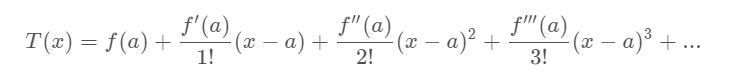
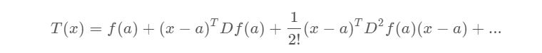
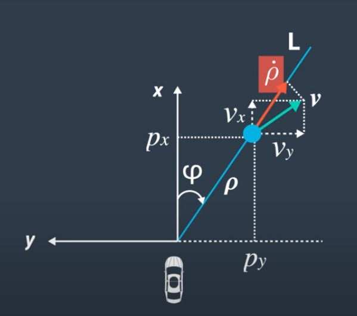
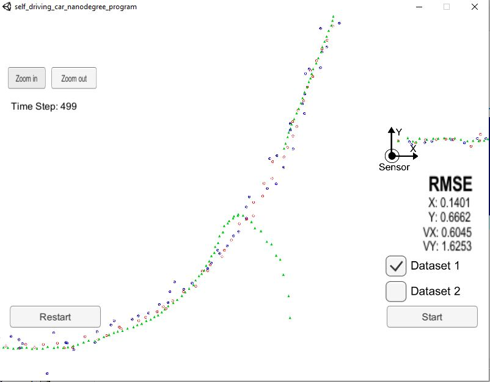
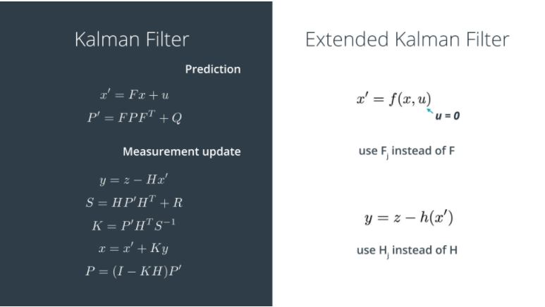
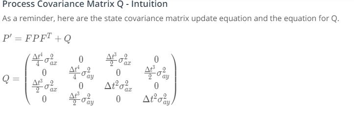
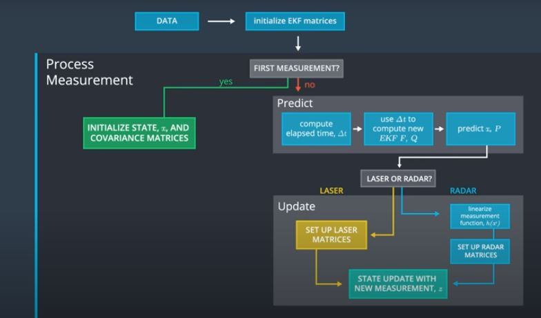
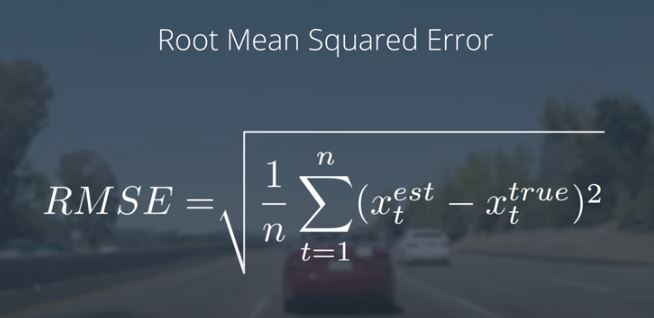
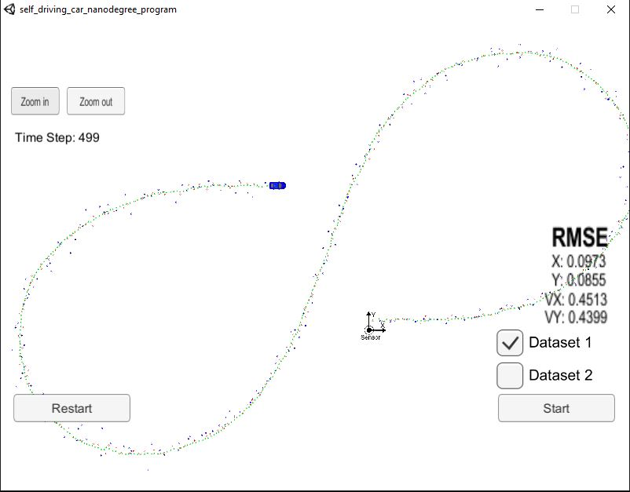
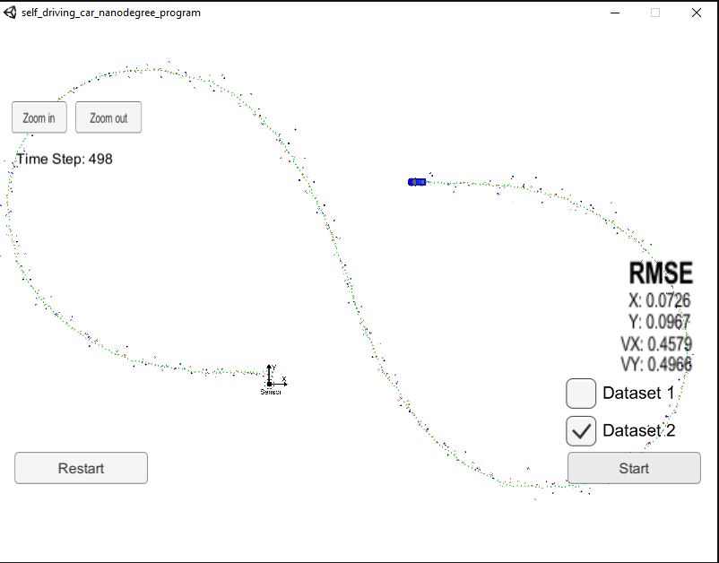

# Sensor Fusion using Kalman filter and Extended Kalman Filter

[](http://www.udacity.com/drive)


<h1> Overview </h1>
<p>  The project focusses using the sensor fusion technique to estimate the position of vehicle (in this case a bicycle) and also the velocity of the vechile in both x and y directions. The sensors used here are RADAR and LiDAR. RADAR sensors are useful for measuring the velocity and direction of the movement of the object. Similarily LiDAR is used to measure the x and y position of the object. So we fuse both these sensors to get the estimate of x & y position and x & y direction velocity. The sensors have noise in their readings and so we need to process it to get accurate position and velocity which is the key for the self driving car. Here we use the Kalman filter approch to provide estimation of the moving object. <p>
 
<h1> Sensor data processing technique </h1>

<p> The LiDAR sensor provides a measurement of the position of the object in x and y dimensions. These values are all linear in nature. So the Kalman filter is directly used to process the sensor data. The Kalman filter uses Gaussian distribution and provides and output in a Gaussian Curve with mean and SD.On the other hand the RADAR provides a non linear measurements (involving sqaure roots which are non linear). Since the kalman filter uses Gaussian distribution it cannot handle non linear data. Since a non linearity changes the shape of the Gaussian distribution as shown below.</p>


<p> So to solve this we use a linearized version of the curve by taking the origin as the equilibrium point and linearize around a small neighbourhood. We use taylor series expansion and take the first two terms as they show the linear region around the origin.</p>



<p> Since this problem involves 3D (3 measurments). We need to use multivariate taylor series to perform the linearzition around the equilibrium point.</p>



<p> where Df(a) is called the Jacobian matrix and D^2 f(a) is called the Hessian matrix. They represent first order and second order derivatives of multi-dimensional equations. Here we consider only the Jacobian matrix for linearization. Thus now if we use Kalman filter over the linearized version of the measurment curve, the Gaussian distribution is preserved at the output as in the image. This use of Jacobian in the kalman filter leads to the use of Extended Kalman filtering.</p>


 
<p> The RADAR provides three measurments values. The Rho provides the radial distance from the origin. The phi provided the angle between the Rho line and x axis. Finally the Rho dot provides the radial velocity of the object which is tracked.</p>




<p> These measurments being highly non linear may need to be converted to linear values around the equilibrium point by the use of Jacobians. Since we have 4 states we need to compute the Jacobian (partial differential) for each of the states and for each of the measurement value.</p>


 
 <p> The key point here is that the phi values is obtained from arctan function. In C++, atan2() returns values between -pi and pi. When calculating phi in y = z - h(x) for radar measurements, the resulting angle phi in the y vector should be adjusted so that it is between -pi and pi. The Kalman filter is expecting small angle values between the range -pi and pi. When working in radians, we can add 2π or subtract 2π until the angle is within the desired range. Without normalization we obtain the below abnormality in prediction.</p>



<h1> Kalman Filter and Extended Kalman filter </h1>

<p> The kalman filter first initializes all its matrices and then performs predict and update continuously. The various matrices are as below </p>

<ul>
 <li> x -> State vector. This denotes the possible states to be predicted. (size : Number of states x 1) </li>
 <li> P -> Uncertainity Matrix. This denotes the uncertainity in the prediction. The matrix is of diagonal matrix with the uncertinities of each state in the corresponding element. Each time after updation the Kalman filter reduces the error and therby reducing the value in the matrix. A value closer to zero is that Filter output is perfect. (Size : Number of states x Number of states).</li>
 <li> F -> State Transition Matrix. This denotes the state transition equation for each states. (Size : Number of States x Number of States). </li>
 <li> H -> Measurement Matrix. This is useful for selecting the new states values from the measurements vector which may contain all the measurements (Size : Number of measurements x Number of states). </li>
 <li> R -> Measurement Uncertainity. This denotes the uncertainity in the sensor values. This is also a diagonal matrix with uncertainity for each measurement in the corresponding diagonal. (Size: Number of measurements x Number of Measurements). </li>
</ul>

<h3> Kalman filter Initialization </h3>

<H5> State transition Matrix </h5>

<p>The state equations are given below. </p>
<UL>
 <li> X(t+1) = X(t) + (X`(t) * dt) </li>
 <li> Y(t+1) = Y(t) + (Y`(t) * dt) </li>
 <li> X`(t+1) = X`(t) </li>
 <li> Y`(t+1) = Y`(t) </li>
</UL>
<p> Here X(t),Y(t) are the correponding position and X`(t),Y`(t) are corresponding velocities. The State transition matrix is initialized as below</p>


<h5>Uncertainity Matrix </h5>

<p> The initial X and Y position of the car is know as it is in origin. So we set 0 in P matrix.Since the velocities are unknown we set higher values in uncertainity matrix.</p>

P = 

<table>
 <tr>
  <td>0</td>
  <td>0</td>
  <td>0</td>
  <td>0</td>
 </tr>
 <tr>
  <td>0</td>
  <td>0</td>
  <td>0</td>
  <td>0</td>
 </tr>
 <tr>
  <td>0</td>
  <td>0</td>
  <td>1000</td>
  <td>0</td>
 </tr>
 <tr>
  <td>0</td>
  <td>0</td>
  <td>0</td>
  <td>1000</td>
 </tr>
</table>

<h5>Measurment Matrix </h5>

<p>Since we use Kalman filtering approach for LiDAR values and Extended Kalman filtering approach for RADAR values we have separate H matrix for both.</p>


H (for LiDAR) = 

<table>
 <tr>
  <td>1</td>
  <td>0</td>
  <td>0</td>
  <td>0</td>
 </tr>
 <tr>
  <td>0</td>
  <td>1</td>
  <td>0</td>
  <td>0</td>
 </tr>
</table>

H (for RADAR. Its the Jacobian matrix) = 


<h5> Measurement Uncertainity Matrix </h5>

<p> The General form of R matrix is as below. The diagonal terms means noise variance in the corresponding sensor values. This info is sometimes provided by the sensor manufacturer. </p>


<p>Since we use two sensors for measurements, we have 2 matrices here.</p>

R (for LiDAR) = 

<table>
 <tr>
  <td>0.0225</td>
  <td>0</td>
 </tr>
 <tr>
  <td>0</td>
  <td>0.0225</td>
 </tr>
</table>

R (for RADAR) = 

<table>
 <tr>
  <td>0.09</td>
  <td>0</td>
  <td>0</td>
 </tr>
 <tr>
  <td>0</td>
  <td>0.0009</td>
  <td>0</td>
 </tr>
 <tr>
  <td>0</td>
  <td>0</td>
  <td>0.09</td>
 </tr>
</table>


<h3> Kalman filter equations </h3>

<p> The images shows the equations of Kalman filters and Extended Kalman filters as well. The only change we do for EKF is that we use the Jacobian matrix in determining the state and in measurement update. </p>



<p> Here we assume that the noise is of zero mean Gaussian distribution and ignore the parameter 'u' while determining the next state. But there is still some uncertainity in the object measurmenets. The motion noise contributes significantly. The model assumes that the object's velocity is constant between the time intervals. But practically it is not the case. The Object's velocity may be changed due to acceleration. This introduces motion noise and so we model our state equation by including acceleration as well. </p>

<UL>
 <li> Px` = Px + (Vx * dt) + (ax * dt^2 /2) </li>
 <li> Py` = Py + (Vy * dt) + (ay * dt^2 /2) </li>
 <li> Vx` = Vx             + (ax * dt) </li>
 <li> Vy` = Vy             + (ay * dt) </li>
</UL>
<p> -------------------------- &#8287; #################### </p>

<p>    deterministic part    &#8287;&#8287;&#8287;&#8287;&#8287;&#8287;&#8287;   Random noise (Stochastic part). </p>

<p> To solve this we usually add a certain offset to the P matrix indicating the Kalman filter that the estimation is not fully correct. So that even after convergence the kalman filter captures the change in velocity. This is achieved by a process covariance matrix. Here we use variance noise_ax = 9 and variance noise_ay = 9 </p>




<h1>Implementation Architecture </h1>

<p> The input data is obtained from LiDAR and RADAR sensors. The data is of the form of measurement package. Here the data is stored in the file obj_pose-laser-radar-synthetic-input.txt. The data is of the below form: </p>

<p> For a row containing radar data, the columns are: sensor_type, rho_measured, phi_measured, rhodot_measured, timestamp, x_groundtruth, y_groundtruth, vx_groundtruth, vy_groundtruth, yaw_groundtruth, yawrate_groundtruth.</p>

<p>For a row containing lidar data, the columns are: sensor_type, x_measured, y_measured, timestamp, x_groundtruth, y_groundtruth, vx_groundtruth, vy_groundtruth, yaw_groundtruth, yawrate_groundtruth.</p>

<p>Whereas radar has three measurements (rho, phi, rhodot), lidar has two measurements (x, y). We also assume that the RADAR and LiDAR data comes one after the other with a delay dt. The code can be manipulated to make get them simultaneously by setting dt = 0 in LiDAR data as it comes first and predict the result. This dt = 0 enables the states to be in the same previous value but only the updation of matrices takes place and when we obtain the RADAR data we make the predict for the next time stamp followed by update. The sensor fusion general flow is given below.</p>



<p> Here is a brief overview of what happens when you run the code files: </p>
<OL>
 <LI> Main.cpp reads in the data and sends a sensor measurement to FusionEKF.cpp </LI>
 <LI> FusionEKF.cpp takes the sensor data and initializes variables and updates variables. The Kalman filter equations are not in this file. FusionEKF.cpp has a variable called ekf_, which is an instance of a KalmanFilter class. The ekf_ will hold the matrix and vector values. You will also use the ekf_ instance to call the predict and update equations.</LI>
 <LI>The KalmanFilter class is defined in kalman_filter.cpp and kalman_filter.h. You will only need to modify 'kalman_filter.cpp', which contains functions for the prediction and update steps.</LI>
</OL>

<h1> Accuracy Estimation </h1>

<p> To measure the accuracy of the state prediction we use a root mean square error function. The dataset comes with the ground truth of the object(cycle) position which can be compared with the prediction to get the accuracy. The accuracy here is 0.0973 for state x, 0.0855 for state y, 0.4513 for velocity in x direction and 0.4399 for velocity in y direction for dataset 1.</p>



<h1> Sensor Fusion Implementation </h1>

```
The simulator can be downloaded in the link (Term 2 Simulator V1.45)
https://github.com/udacity/self-driving-car-sim/releases
Installation of dependencies (uWebsocket)

apt-get install zlib1g-dev
./install-linux.sh (based on linux distribution)

To Run the project.
First Start the simulator for ekf and ukf project.
Now in terminal in project path

mkdir build
cd build
cmake ..
make
./ExtendedKF

Now in simulator select the dataset and click start.

```

<h1> Results </h1>

<p>The result of sensor fusion estimation for dataset 1 is given below. The LiDAR measurements are red circles, RADAR measurements are blue circles with an arrow pointing in the direction of the observed angle, and estimation markers are green triangles. </p>



<p> In dataset 2 the car moves in the reverse direction and the corresponding output is shown below. </p>


